# Weather Dashboard Pro

[](https://github.com/jalalakbar47/Weather-Dashboard_Pro/search?l=javascript)
[](https://react.dev/)
[](https://github.com/jalalakbar47/Weather-Dashboard_Pro/blob/main/LICENSE)
[](https://github.com/jalalakbar47/Weather-Dashboard_Pro/stargazers)
[](https://github.com/jalalakbar47/Weather-Dashboard_Pro/network/members)
[](https://github.com/jalalakbar47/Weather-Dashboard_Pro/issues)
[](https://github.com/jalalakbar47/Weather-Dashboard_Pro/commits/main)
[](https://github.com/jalalakbar47/Weather-Dashboard_Pro/actions/workflows/copilot-swe-agent/copilot)
[](https://weather-dashboard-pro.vercel.app)

A modern React.js weather dashboard built with Vite, vanilla CSS, LocalStorage persistence, charts, favorites, geolocation, and a polished SaaS-style interface.

## About

Weather Dashboard Pro is designed as a GitHub-ready portfolio project that combines practical weather data with a clean premium UI. It supports city search, unit switching, saved locations, recent lookups, weather highlights, hourly trends, and smooth light/dark mode transitions.

## Features

- Search weather by city name
- Current weather with city, country, temperature, condition, icon, feels-like, humidity, wind, pressure, and visibility
- 5-day forecast
- Hourly forecast support
- Temperature chart built with Recharts
- Favorite cities
- Recent searches
- Dark and light mode
- LocalStorage persistence
- Loading spinner and skeleton state
- Error handling for invalid cities and API failures
- Geolocation weather via "Use My Location"
- Weather highlights cards
- Sunrise and sunset times
- Air quality index support when provided by the API
- UV index support when provided by the API
- Weather-based background changes
- Celsius / Fahrenheit toggle
- Empty state before first search
- Toast notifications
- Fully responsive layout for mobile, tablet, and desktop

## Screenshots

### 🌑 Desktop – Dark Mode

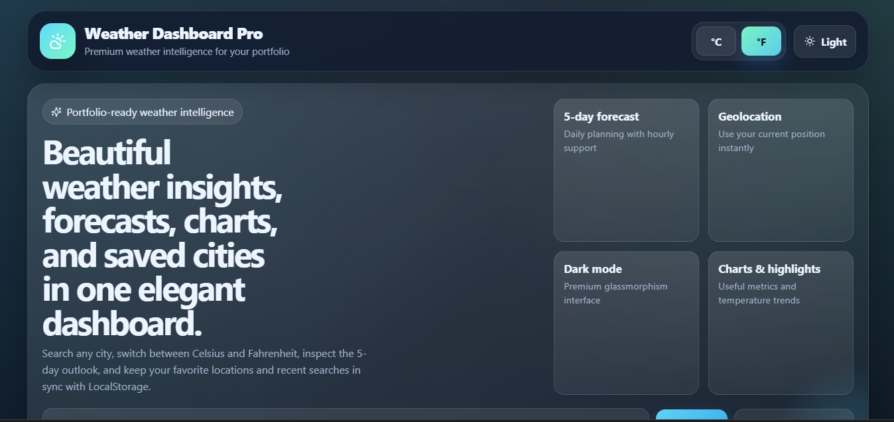
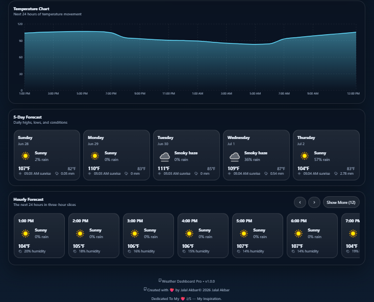
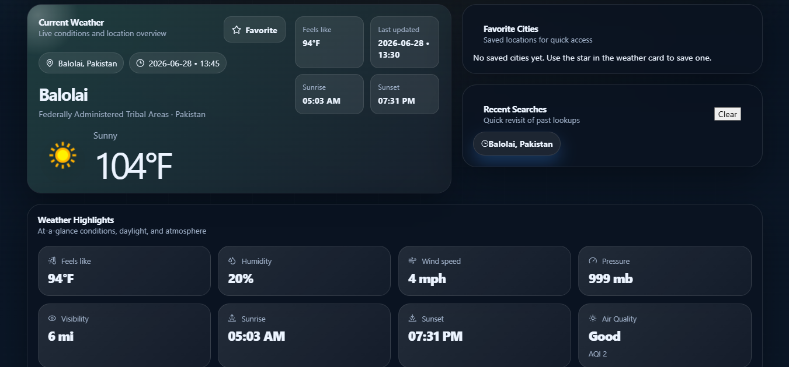
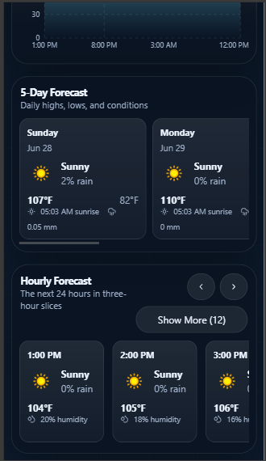

### ☀️ Desktop – Light Mode

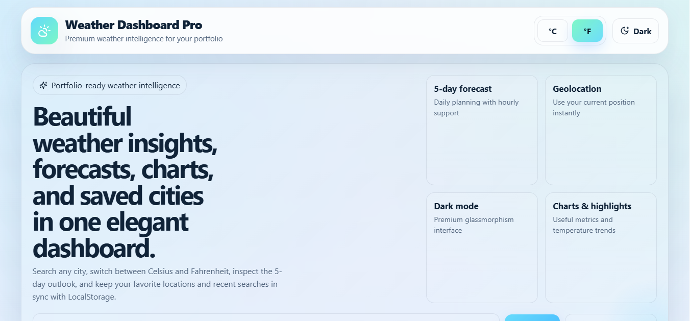
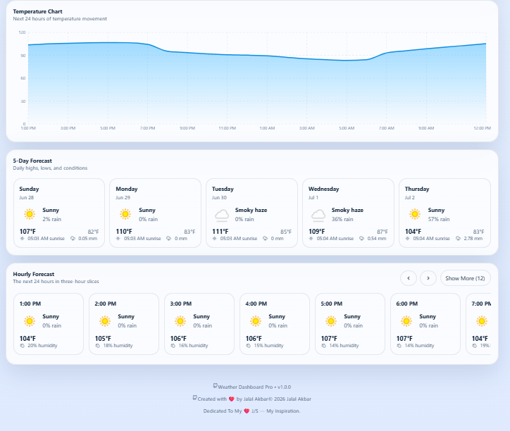
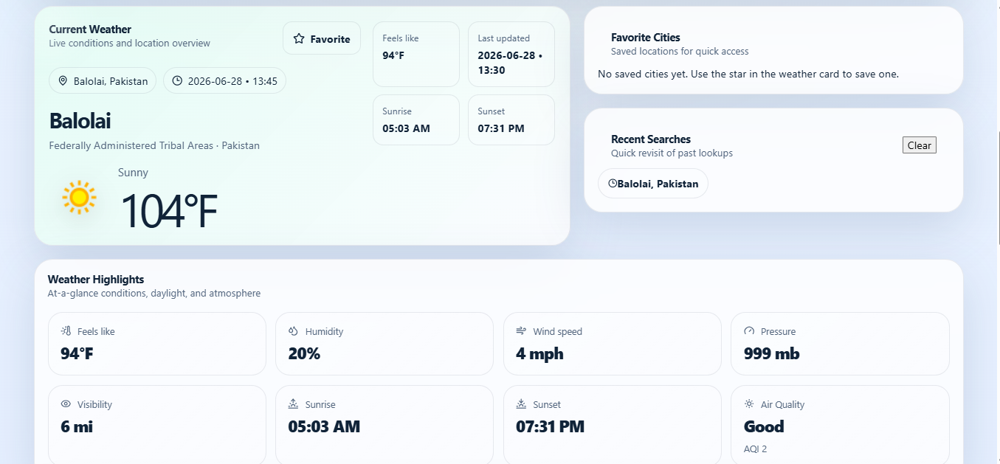
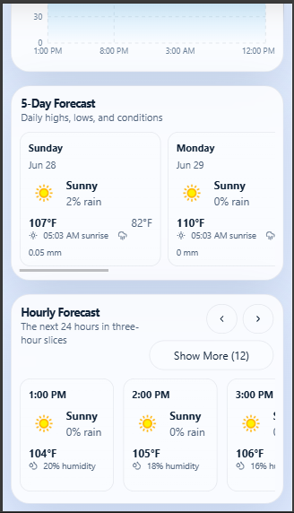

### 📱 Mobile – Dark Mode

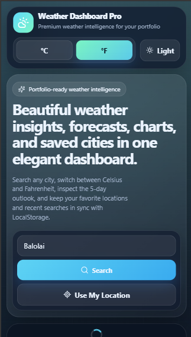
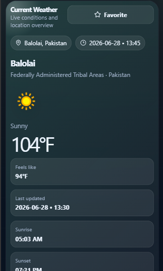
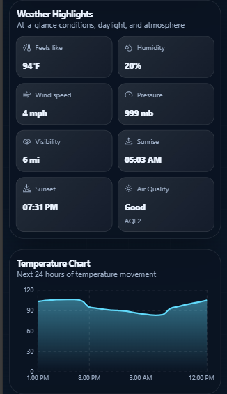

### 📱 Mobile – Light Mode

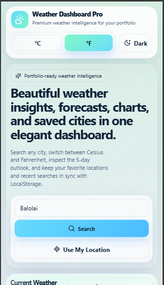
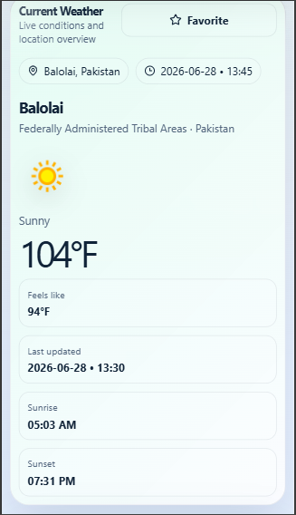
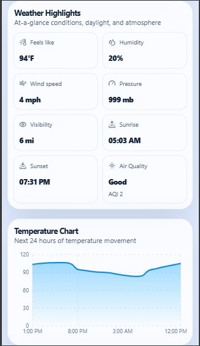

## Tech Stack

- React JS
- Vite
- Vanilla CSS
- LocalStorage
- Lucide React Icons
- Recharts
- WeatherAPI

## API Setup

This project uses WeatherAPI.

1. Create an account at [WeatherAPI](https://www.weatherapi.com/).
2. Copy your API key.
3. Create a `.env` file in the project root.
4. Add the following variable:

```env
VITE_WEATHER_API_KEY=your_api_key_here
```

Optional:

```env
VITE_WEATHER_API_BASE=https://api.weatherapi.com/v1
```

A sample file is provided at `.env.example`.

## Installation

```bash
npm install
npm run dev
```

Build for production:

```bash
npm run build
```

Preview production build:

```bash
npm run preview
```

## Git Workflow

For small updates, keep commits focused and push them separately so the history stays easy to review:

```bash
git add .
git commit -m "Describe the small change"
git push
```

## Folder Structure

```text
src/
  components/
    common/
      ThemeToggle.jsx
      Toast.jsx
      Loader.jsx
      EmptyState.jsx
    layout/
      Header.jsx
      Footer.jsx
    weather/
      SearchBar.jsx
      CurrentWeather.jsx
      ForecastCard.jsx
      ForecastList.jsx
      WeatherHighlights.jsx
      WeatherChart.jsx
      FavoriteCities.jsx
      RecentSearches.jsx
      UnitToggle.jsx
  services/
    weatherApi.js
  utils/
    localStorage.js
    dateFormatter.js
    weatherHelpers.js
  styles/
    variables.css
    globals.css
    layout.css
    weather.css
    responsive.css
  App.jsx
  main.jsx
  index.css
```

## Future Improvements

- Add server-side caching for API responses
- Add advanced weather alerts filtering
- Add map view for tracked cities
- Add PWA offline support
- Add unit tests and component tests
- Add CSV export for forecast data

## Author & Dedication
Created with ❤️ by Jalal Akbar
> Dedicated To My ❤️ J/S — My Inspiration.
## License
MIT License
